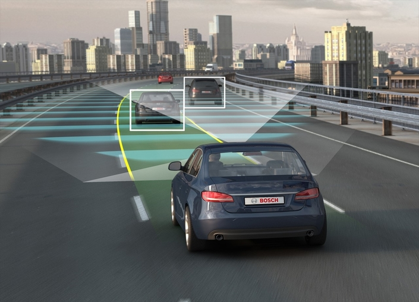
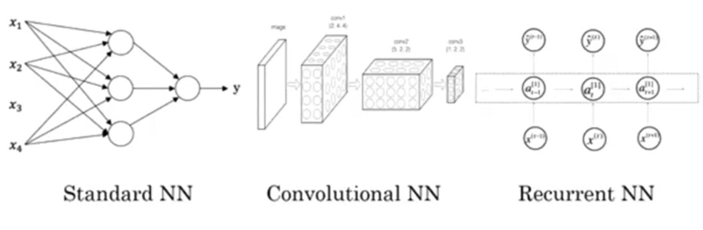
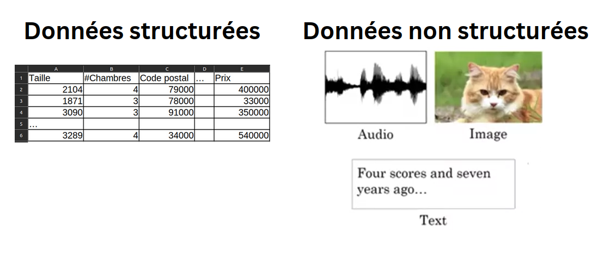

Les réseaux neuronaux ont fait l'objet d'un grand débat médiatique. Peut-être qu'une partie de ce débat est justifiée, étant donné la qualité de leur fonctionnement.
Il s'avère que jusqu'à présent, la quasi-totalité de la valeur économique créée par les réseaux neuronaux a mis en jeu un type d'apprentissage machine appelé apprentissage supervisé.

Voyons ce que cela signifie, et passons en revue quelques exemples.

## Applications d'apprentissage supervisé utilisant des réseaux de neurones

Dans l'apprentissage supervisé, vous avez une entrée x et vous voulez entrainer une fonction pour qu'elle prédise une sortie y.
Nous venons de voir l'application de prédiction de prix de logements où x contient certaines caractéristiques d'une maison et y correspond à son prix.
Voici des exemples d'applications pour lesquels l'utilisation de réseaux de neurones est très efficace.

| Entrée (x)                    | Sortie (y)                 | Application            |
|-------------------------------|----------------------------|------------------------|
| Caractéristiques d'une maison | Prix                       | Immobilier             |
| Publicité, info utilisateur   | Click sur la pub? (0/1)    | Publicité en ligne     |
| Image                         | Objet (1,...,1000)         | Etiquetage de photos   |
| Audio                         | Transcription du texte     | Reconnaissance vocale  |
| Anglais                       | Chinois                    | Traduction automatique |
| Image, info radar             | Position d'autres voitures | Conduite autonome      |

- L'application la plus lucrative de l'apprentissage profond aujourd'hui est probablement la publicité en ligne. En entrant des informations sur une publicité, quelques informations sur un utilisateur
visitant un site web, les réseaux de neurones sont devenus très bons pour prédire si vous allez cliquer ou non sur cette publicité. Selon leur prédiction, on peut alors décider d'afficher la publicité concernée ou bien en choisir une autre.

- La vision par ordinateur a également fait d'énormes progrès au cours des dernières années, principalement grâce au Deep Learning.
Vous pouvez ainsi fournir une image en entrée à un réseau de neurones et demander en sortie un nombre allant de 1 à 1000 associant cette image à un objet. Cela permet notamment l'étiquetage de photos.

- Les progrès récents dans la reconnaissance vocale sont également très intéressants. Il est maintenant possible d'entrer un clip audio dans un réseau de neurones et de récupérer en sortie une transcription
textuelle de cet audio.

- La traduction automatique a également fait d'énormes progrès grâce au Deep Learning. Il est possible de demander à un réseau de neurones d'entrer une phrase en anglais et de produire en sortie une phrase en chinois par exemple.

- Enfin, dans le domaine de la conduite autonome, on peut entrer une photo de ce qui se trouve devant une voiture, ainsi que des informations sur l'état de la route empruntée fournies par un radar, et récupérer en sortie la position des autres véhicules par rapport à la voiture sur cette route.

Une grande partie de la création de valeur à travers les réseaux de neurones provient en fait d'une sélection intelligente de ce qui devrait être x et de ce qui devrait être y pour des problèmes particuliers.

## Types de réseaux de neurones

Il s'avère qu'il existe des types de réseaux de neurones légèrement différents adaptés à différentes applications.

- Pour les applications d'imagerie (identification faciale, reconnaissance d'objets) on utilise souvent des réseaux de neurones convolutifs (en anglais CNNs - Convolutional neural networks).

- Pour traiter des données séquentielles (fichiers audio, texte à traduire) on utilise des réseaux de neurones récurrents (en anglais RNNs - recurrent neural networks)

- Pour des applications plus complexes (comme la conduite autonome), on utilise des réseaux de neurones hybrides personnalisés

## Données structurées vs non structurées

Une donnée structurée est une donnée qui a été prédéfinie et formatée selon une structure précise tandis qu'une donnée non structurée est une donnée stockée dans son format d'origine et non traitée avant son utilisation.

Historiquement, il a été beaucoup plus difficile pour les ordinateurs de donner du sens aux données non structurées par rapport aux données structurées.
L'espèce humaine a évolué et est devenue très douée pour comprendre les signaux audio, les images et le texte. Pendant longtemps, les ordinateurs ne pouvaient pas faire de même. 

Ce qui est impresionnant avec le Deep Learning, c'est que les ordinateurs sont maintenant bien meilleurs pour interpréter des données non structurées.
Cela crée des opportunités pour de nombreuses nouvelles applications qui utilisent la reconnaissance vocale, la reconnaissance d'images, le traitement du langage naturel, et plein d'autres technologies qui n'existaient pas il y a quelques années.

La plupart des techniques que nous allons aborder s'appliqueront à la fois aux données structurées et aux données non structurées.

Dans le prochain cours, nous verrons pourquoi ce n'est que très récemment que les réseaux de neurones sont devenus un outil incroyablement puissant. 
