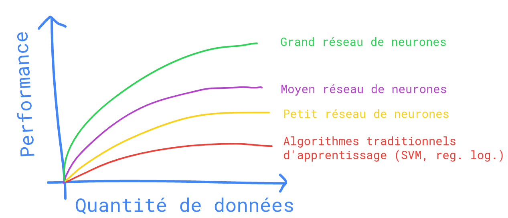

Si les idées techniques de base derrière le Deep Learning existent depuis des décennies, pourquoi est-ce que l'essor de ce dernier ne commence que maintenant ? 
Dans ce cours, nous allons passer en revue certains des principaux moteurs derrière l'essor du Deep Learning.

Traçons un graphique où sur l'axe horizontal est représenté la quantité de données utilisées pour effectuer une tâche et sur l'axe vertical, la performance de l'algorithme d'apprentissage utilisé pour effectuer cette tâche.

Il s'avère que si vous tracez les performances d'un algorithme d'apprentissage traditionnel comme le SVM (machine à vecteur de support) ou la régression logistique en fonction de la quantité de données disponible pour entrainer cet algorithme, vous obtenez la courbe rouge. 
La performance s'améliore pendant un certain temps lorsque vous vous ajoutez des données, mais après un certain temps, un plateau est atteint et la performance arrête d'augmenter.

Les réseaux de neurones possèdent des plateaux de performance plus élevés et peuvent donc être plus performants que les algorithmes d'apprentissage traditionnels lorsqu'on dispose de suffisamment de données.
Or, la quantité de données disponibles pour entrainer ces algorithmes n'a énormément augmenté qu'avec la numérisation de notre société, principalement au cours des 10 dernières années.

La taille des réseaux de neurones utilisés ainsi que la quantité de données disponibles ont donc constitué des éléments moteur de l'essor du Deep Learning.
On notera également que certaines innovations algorithmiques ont permis de faire fonctionner des réseaux de neurones beaucoup plus rapidement.
Un exemple concret de l'une des grandes percées dans les réseaux de neurones a été d'utiliser la fonction d'activation ReLU (vue précedemment) à la place de la fonction sigmoïde, qui ressemble à ceci. 

