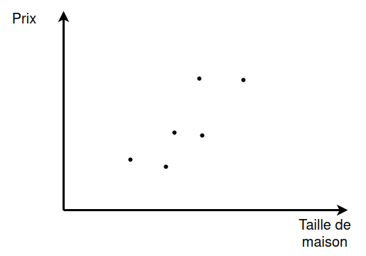
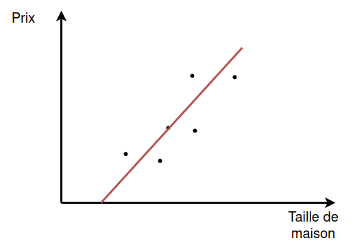
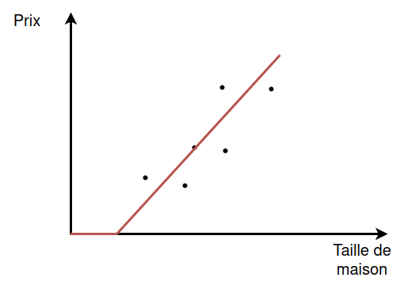
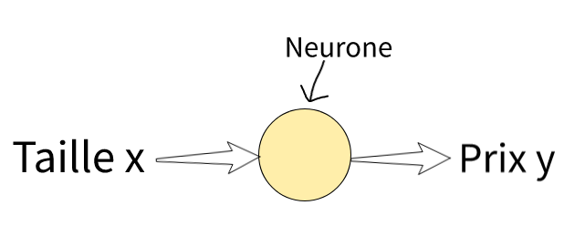
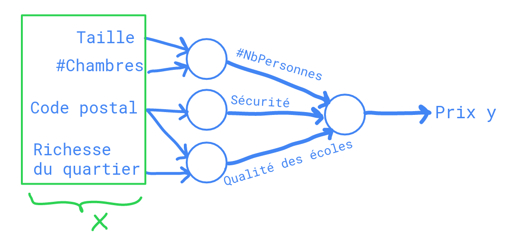

Le terme "Deep Learning" fait référence à l'entrainement de réseaux de neurones, parfois de très grands réseaux de neurones. Mais qu'est-ce qu'un réseau de neurones exactement ?

## Prédiction de prix de logements en fonction de leur taille

Considérons le problème suivant : vous cherchez à prédire des prix de logements.
Disons que vous avez un ensemble de données avec six maisons, que vous connaissez la taille des maisons en mètres carrés ainsi que leur prix.
Vous voulez ajuster une fonction pour prédire le prix d'une maison en fonction de sa taille.

Si vous êtes familier avec la régression linéaire, vous pourriez dire, eh bien mettons une ligne droite en utilisant la méthode des moindres carrés et nous obtenons la figure ci-dessous.

Mais pour être plus précis, vous pourriez dire, nous savons que les prix ne peuvent jamais être négatifs. Donc, au lieu d'un ajustement affine, qui finira par prendre des valeurs négatives,
on va modifier la fonction pour qu'elle soit nulle en dessous d'une certaine taille.

Vous pouvez donc considérer cette fonction que vous venez d'adapter aux prix des logements comme un réseau de neurones très simple.
Représentons ce réseau de neurones sur un dessin.

Nous avons comme entrée du réseau de neurones la taille d'une maison, que nous appelons x. Elle entre dans un noeud représenté par un cercle et puis de ce noeud sort le prix prédit que nous appelons y.

Le noeud est en fait un neurone unique dans le réseau de neurones qui implémente la fonction que l'on a dessiné ci-dessus.
Tout ce que fait le neurone, c'est récupérer la taille en argument d'entrée, calculer l'image de cette taille par notre fonction, et renvoyer le prix estimé.
Vous verrez d'ailleurs souvent cette fonction qui s'appelle ReLU (Rectified linear unit).

"Rectified" signifie que l'on choisit un minimum égal 0 et "linear" signifie que la fonction est linéaire (ici à partir d'un certain seuil).
Vous n'avez pas besoin de vous soucier de la fonction ReLU pour l'instant mais c'est quelque chose que vous reverrez plus tard dans ce cours.

Un réseau de neurones est en fait formé de plusieurs neurones uniques empilées ensembles.

## Prédiction de prix de logements en fonction de plusieurs paramètres

Prenons un exemple. Disons qu'au lieu de prédire le prix d'une maison uniquement à partir de sa taille, vous avez maintenant d'autres caractéristiques. Vous connaissez d'autres choses sur la maison, 
tel que le nombre de chambres, noté "#chambres", ainsi que le code postal et la richesse du quartier dans lequel se situe la maison.

Vous pouvez alors vous dire qu'il est possible de prédire le nombre de personnes, noté #NbPersonnes, vivant dans cette maison à partir de la taille et du nombre de chambre de cette dernière.
Le code postal et la richesse du quartier peuvent être utilisés pour prédire la sécurité, et la richesse seule peut permettre de prédire la qualité des écoles (les familles riches s'installent dans les quartiers ou l'éducation est de bonne qualité donc les prix sont souvent plus élevés).

Enfin, les trois sorties des noeuds du milieu peuvent être utilisés comme arguments d'entrée du noeud final afin d'obtenir une prédiction du prix de la maison concernée.

Dans cet exemple, x est un vecteur contenant l'ensemble des quatre entrées et y est le prix que l'on essaie de prédire.
En empilant quelques neurones uniques nous avons maintenant un réseau de neurones légèrement plus grand.

Chaque noeud du réseau possède sa propre fonction que l'on appelle fonction d'activation. Entrainer un réseau de neurones, c'est ajuster toutes les fonctions des noeuds de manière à ce que le prix
prédit soit le plus proche possible du prix réel. Pour entrainer notre réseau de neurones, il faut donc lui fournir des exemples de maisons (c'est à dire des exemples de caractéristiques et de prix associés). 
En réalité, les noeuds du milieu (situés entre l'entrée et la sortie) sont gérés par le réseau de neurones et l'on n'a pas besoin de leur donner une signification. Le réseau de neurones se débrouille pour
ajuster leur fonction d'activation de manière à obtenir de meilleures prédictions.

Nous verrons dans le prochain cours certaines applications d'apprentissage supervisé (supervised learning) des réseaux de neurones.
